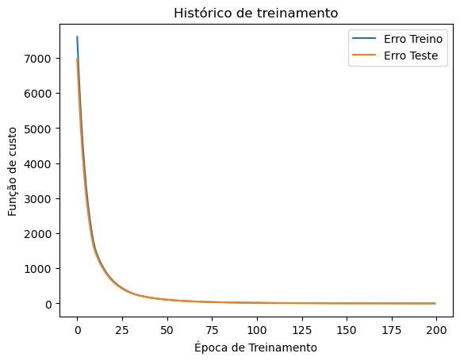

```python
import tensorflow as tf
from tensorflow import keras
import pandas as pd

```

    2023-04-02 12:38:36.543876: I tensorflow/core/platform/cpu_feature_guard.cc:193] This TensorFlow binary is optimized with oneAPI Deep Neural Network Library (oneDNN) to use the following CPU instructions in performance-critical operations:  SSE4.1 SSE4.2
    To enable them in other operations, rebuild TensorFlow with the appropriate compiler flags.


```python
df = pd.read_csv("/home/elcio/POS_Aulas/admission_dataset.csv")

```


```python
df
```


<div>

<table border="1" class="dataframe">
  <thead>
    <tr style="text-align: right;">
      <th></th>
      <th>GRE Score</th>
      <th>TOEFL Score</th>
      <th>University Rating</th>
      <th>SOP</th>
      <th>LOR</th>
      <th>CGPA</th>
      <th>Research</th>
      <th>Chance of Admit</th>
    </tr>
  </thead>
  <tbody>
    <tr>
      <th>0</th>
      <td>315</td>
      <td>105</td>
      <td>3</td>
      <td>2.0</td>
      <td>2.5</td>
      <td>8.48</td>
      <td>0</td>
      <td>0.75</td>
    </tr>
    <tr>
      <th>1</th>
      <td>321</td>
      <td>112</td>
      <td>5</td>
      <td>5.0</td>
      <td>5.0</td>
      <td>9.06</td>
      <td>1</td>
      <td>0.86</td>
    </tr>
    <tr>
      <th>2</th>
      <td>327</td>
      <td>103</td>
      <td>3</td>
      <td>4.0</td>
      <td>4.0</td>
      <td>8.30</td>
      <td>1</td>
      <td>0.74</td>
    </tr>
    <tr>
      <th>3</th>
      <td>305</td>
      <td>112</td>
      <td>3</td>
      <td>3.0</td>
      <td>3.5</td>
      <td>8.65</td>
      <td>0</td>
      <td>0.71</td>
    </tr>
    <tr>
      <th>4</th>
      <td>297</td>
      <td>96</td>
      <td>2</td>
      <td>2.5</td>
      <td>1.5</td>
      <td>7.89</td>
      <td>0</td>
      <td>0.43</td>
    </tr>
    <tr>
      <th>...</th>
      <td>...</td>
      <td>...</td>
      <td>...</td>
      <td>...</td>
      <td>...</td>
      <td>...</td>
      <td>...</td>
      <td>...</td>
    </tr>
    <tr>
      <th>395</th>
      <td>320</td>
      <td>111</td>
      <td>4</td>
      <td>4.5</td>
      <td>3.5</td>
      <td>8.87</td>
      <td>1</td>
      <td>0.85</td>
    </tr>
    <tr>
      <th>396</th>
      <td>305</td>
      <td>103</td>
      <td>2</td>
      <td>2.5</td>
      <td>3.5</td>
      <td>8.13</td>
      <td>0</td>
      <td>0.59</td>
    </tr>
    <tr>
      <th>397</th>
      <td>305</td>
      <td>107</td>
      <td>2</td>
      <td>2.5</td>
      <td>2.5</td>
      <td>8.42</td>
      <td>0</td>
      <td>0.71</td>
    </tr>
    <tr>
      <th>398</th>
      <td>320</td>
      <td>104</td>
      <td>3</td>
      <td>3.0</td>
      <td>2.5</td>
      <td>8.57</td>
      <td>1</td>
      <td>0.74</td>
    </tr>
    <tr>
      <th>399</th>
      <td>331</td>
      <td>120</td>
      <td>3</td>
      <td>4.0</td>
      <td>4.0</td>
      <td>8.96</td>
      <td>1</td>
      <td>0.86</td>
    </tr>
  </tbody>
</table>
<p>400 rows × 8 columns</p>
</div>


```python
y = df["Chance of Admit " ] 
x = df.drop("Chance of Admit ", axis = 1) 

x_treino, x_teste = x[0:300], x[300:] 
y_treino, y_teste = y[0:300], y[300:] 

```


```python
from keras.models import Sequential
from keras.layers import Dense

```


```python
# Criando a arquitetura da rede neural:
modelo = Sequential()
modelo.add(Dense(units=6, activation="relu", input_dim=x_treino.shape[1]))
modelo.add(Dense(units=1, activation="linear")) #neuronio de saida

```


```python
modelo.compile(loss="mse", optimizer="adam", metrics=["mae"])
resultado = modelo.fit(x_treino, y_treino, epochs=200, batch_size=32, validation_data=(x_teste, y_teste))

```

    Epoch 1/200
    10/10 [==============================] - 2s 63ms/step - loss: 7597.8291 - mae: 87.0760 - val_loss: 6968.3467 - val_mae: 83.4245
    Epoch 2/200
    10/10 [==============================] - 0s 38ms/step - loss: 6446.2959 - mae: 80.2121 - val_loss: 5902.1768 - val_mae: 76.7781
    Epoch 3/200
    10/10 [==============================] - 0s 34ms/step - loss: 5457.0674 - mae: 73.8012 - val_loss: 4992.7427 - val_mae: 70.6160
    Epoch 4/200
    10/10 [==============================] - 0s 35ms/step - loss: 4617.6016 - mae: 67.8956 - val_loss: 4229.8281 - val_mae: 64.9976
    Epoch 5/200
    10/10 [==============================] - 0s 26ms/step - loss: 3917.1899 - mae: 62.5242 - val_loss: 3589.1975 - val_mae: 59.8738
    Epoch 6/200
    10/10 [==============================] - 0s 25ms/step - loss: 3328.6096 - mae: 57.6378 - val_loss: 3054.9529 - val_mae: 55.2385
    Epoch 7/200
    10/10 [==============================] - 0s 23ms/step - loss: 2836.3552 - mae: 53.2085 - val_loss: 2607.2393 - val_mae: 51.0307
    Epoch 8/200
    10/10 [==============================] - 0s 26ms/step - loss: 2423.9453 - mae: 49.1862 - val_loss: 2230.0493 - val_mae: 47.1953
    Epoch 9/200
    10/10 [==============================] - 0s 28ms/step - loss: 2074.6387 - mae: 45.5092 - val_loss: 1910.9301 - val_mae: 43.6882
    Epoch 10/200
    10/10 [==============================] - 0s 30ms/step - loss: 1780.5437 - mae: 42.1569 - val_loss: 1646.8711 - val_mae: 40.5594
    Epoch 11/200
    10/10 [==============================] - 0s 29ms/step - loss: 1559.7135 - mae: 39.4648 - val_loss: 1479.0164 - val_mae: 38.4404
    Epoch 12/200
    10/10 [==============================] - 0s 26ms/step - loss: 1410.2089 - mae: 37.5286 - val_loss: 1344.2477 - val_mae: 36.6475
    Epoch 13/200
    10/10 [==============================] - 0s 27ms/step - loss: 1283.3395 - mae: 35.8011 - val_loss: 1224.7605 - val_mae: 34.9810
    Epoch 14/200
    10/10 [==============================] - 0s 33ms/step - loss: 1170.4237 - mae: 34.1900 - val_loss: 1118.1539 - val_mae: 33.4240
    Epoch 15/200
    10/10 [==============================] - 0s 19ms/step - loss: 1069.4850 - mae: 32.6820 - val_loss: 1022.4246 - val_mae: 31.9613
    Epoch 16/200
    10/10 [==============================] - 0s 25ms/step - loss: 978.7592 - mae: 31.2656 - val_loss: 936.6182 - val_mae: 30.5908
    Epoch 17/200
    10/10 [==============================] - 0s 25ms/step - loss: 897.3315 - mae: 29.9370 - val_loss: 859.4540 - val_mae: 29.3037
    Epoch 18/200
    10/10 [==============================] - 0s 36ms/step - loss: 823.9284 - mae: 28.6879 - val_loss: 789.9230 - val_mae: 28.0934
    Epoch 19/200
    10/10 [==============================] - 0s 28ms/step - loss: 757.9254 - mae: 27.5130 - val_loss: 726.8356 - val_mae: 26.9483
    Epoch 20/200
    10/10 [==============================] - 0s 23ms/step - loss: 697.9504 - mae: 26.4029 - val_loss: 669.9345 - val_mae: 25.8720
    Epoch 21/200
    10/10 [==============================] - 0s 24ms/step - loss: 643.7297 - mae: 25.3568 - val_loss: 618.3846 - val_mae: 24.8567
    Epoch 22/200
    10/10 [==============================] - 0s 36ms/step - loss: 594.6330 - mae: 24.3701 - val_loss: 571.5081 - val_mae: 23.8960
    Epoch 23/200
    10/10 [==============================] - 0s 37ms/step - loss: 549.9228 - mae: 23.4362 - val_loss: 528.8640 - val_mae: 22.9872
    Epoch 24/200
    10/10 [==============================] - 0s 23ms/step - loss: 509.2030 - mae: 22.5516 - val_loss: 489.9472 - val_mae: 22.1253
    Epoch 25/200
    10/10 [==============================] - 0s 26ms/step - loss: 472.0568 - mae: 21.7131 - val_loss: 454.4029 - val_mae: 21.3076
    Epoch 26/200
    10/10 [==============================] - 0s 28ms/step - loss: 438.0558 - mae: 20.9172 - val_loss: 421.9541 - val_mae: 20.5328
    Epoch 27/200
    10/10 [==============================] - 0s 27ms/step - loss: 406.9585 - mae: 20.1612 - val_loss: 392.1737 - val_mae: 19.7949
    Epoch 28/200
    10/10 [==============================] - 0s 42ms/step - loss: 378.4174 - mae: 19.4409 - val_loss: 364.7557 - val_mae: 19.0904
    Epoch 29/200
    10/10 [==============================] - 0s 30ms/step - loss: 352.1137 - mae: 18.7537 - val_loss: 339.5489 - val_mae: 18.4190
    Epoch 30/200
    10/10 [==============================] - 0s 21ms/step - loss: 327.9382 - mae: 18.0980 - val_loss: 316.3170 - val_mae: 17.7776
    Epoch 31/200
    10/10 [==============================] - 0s 27ms/step - loss: 305.6466 - mae: 17.4722 - val_loss: 294.8891 - val_mae: 17.1649
    Epoch 32/200
    10/10 [==============================] - 0s 25ms/step - loss: 285.2201 - mae: 16.8784 - val_loss: 275.4099 - val_mae: 16.5881
    Epoch 33/200
    10/10 [==============================] - 0s 28ms/step - loss: 266.9701 - mae: 16.3292 - val_loss: 258.3104 - val_mae: 16.0645
    Epoch 34/200
    10/10 [==============================] - 0s 23ms/step - loss: 251.0416 - mae: 15.8343 - val_loss: 243.4538 - val_mae: 15.5953
    Epoch 35/200
    10/10 [==============================] - 0s 35ms/step - loss: 236.9983 - mae: 15.3844 - val_loss: 230.1989 - val_mae: 15.1645
    Epoch 36/200
    10/10 [==============================] - 0s 32ms/step - loss: 224.3366 - mae: 14.9675 - val_loss: 218.0652 - val_mae: 14.7593
    Epoch 37/200
    10/10 [==============================] - 0s 30ms/step - loss: 212.6555 - mae: 14.5728 - val_loss: 206.8138 - val_mae: 14.3733
    Epoch 38/200
    10/10 [==============================] - 0s 30ms/step - loss: 201.7745 - mae: 14.1952 - val_loss: 196.3150 - val_mae: 14.0036
    Epoch 39/200
    10/10 [==============================] - 0s 29ms/step - loss: 191.6131 - mae: 13.8328 - val_loss: 186.4684 - val_mae: 13.6478
    Epoch 40/200
    10/10 [==============================] - 0s 26ms/step - loss: 182.0592 - mae: 13.4838 - val_loss: 177.2338 - val_mae: 13.3055
    Epoch 41/200
    10/10 [==============================] - 0s 22ms/step - loss: 173.1135 - mae: 13.1478 - val_loss: 168.5413 - val_mae: 12.9751
    Epoch 42/200
    10/10 [==============================] - 0s 26ms/step - loss: 164.6836 - mae: 12.8237 - val_loss: 160.3827 - val_mae: 12.6570
    Epoch 43/200
    10/10 [==============================] - 0s 25ms/step - loss: 156.7693 - mae: 12.5117 - val_loss: 152.7050 - val_mae: 12.3503
    Epoch 44/200
    10/10 [==============================] - 0s 22ms/step - loss: 149.3174 - mae: 12.2105 - val_loss: 145.4759 - val_mae: 12.0543
    Epoch 45/200
    10/10 [==============================] - 0s 22ms/step - loss: 142.2943 - mae: 11.9198 - val_loss: 138.6592 - val_mae: 11.7685
    Epoch 46/200
    10/10 [==============================] - 0s 23ms/step - loss: 135.6714 - mae: 11.6392 - val_loss: 132.2384 - val_mae: 11.4927
    Epoch 47/200
    10/10 [==============================] - 0s 29ms/step - loss: 129.4257 - mae: 11.3681 - val_loss: 126.1780 - val_mae: 11.2262
    Epoch 48/200
    10/10 [==============================] - 0s 23ms/step - loss: 123.5294 - mae: 11.1060 - val_loss: 120.4546 - val_mae: 10.9685
    Epoch 49/200
    10/10 [==============================] - 0s 27ms/step - loss: 117.9642 - mae: 10.8529 - val_loss: 115.0354 - val_mae: 10.7189
    Epoch 50/200
    10/10 [==============================] - 0s 33ms/step - loss: 112.6942 - mae: 10.6075 - val_loss: 109.9083 - val_mae: 10.4772
    Epoch 51/200
    10/10 [==============================] - 0s 29ms/step - loss: 107.7159 - mae: 10.3701 - val_loss: 105.0611 - val_mae: 10.2435
    Epoch 52/200
    10/10 [==============================] - 0s 28ms/step - loss: 103.0003 - mae: 10.1406 - val_loss: 100.4853 - val_mae: 10.0178
    Epoch 53/200
    10/10 [==============================] - 0s 28ms/step - loss: 98.5449 - mae: 9.9189 - val_loss: 96.1585 - val_mae: 9.7997
    Epoch 54/200
    10/10 [==============================] - 0s 28ms/step - loss: 94.3267 - mae: 9.7042 - val_loss: 92.0546 - val_mae: 9.5882
    Epoch 55/200
    10/10 [==============================] - 0s 25ms/step - loss: 90.3292 - mae: 9.4963 - val_loss: 88.1597 - val_mae: 9.3831
    Epoch 56/200
    10/10 [==============================] - 0s 32ms/step - loss: 86.5411 - mae: 9.2946 - val_loss: 84.4652 - val_mae: 9.1843
    Epoch 57/200
    10/10 [==============================] - 0s 28ms/step - loss: 82.9385 - mae: 9.0991 - val_loss: 80.9678 - val_mae: 8.9921
    Epoch 58/200
    10/10 [==============================] - 0s 32ms/step - loss: 79.5310 - mae: 8.9101 - val_loss: 77.6480 - val_mae: 8.8057
    Epoch 59/200
    10/10 [==============================] - 0s 32ms/step - loss: 76.2877 - mae: 8.7266 - val_loss: 74.4970 - val_mae: 8.6251
    Epoch 60/200
    10/10 [==============================] - 0s 29ms/step - loss: 73.2116 - mae: 8.5488 - val_loss: 71.5053 - val_mae: 8.4501
    Epoch 61/200
    10/10 [==============================] - 0s 28ms/step - loss: 70.2917 - mae: 8.3765 - val_loss: 68.6527 - val_mae: 8.2797
    Epoch 62/200
    10/10 [==============================] - 0s 27ms/step - loss: 67.5089 - mae: 8.2088 - val_loss: 65.9429 - val_mae: 8.1146
    Epoch 63/200
    10/10 [==============================] - 0s 30ms/step - loss: 64.8650 - mae: 8.0462 - val_loss: 63.3617 - val_mae: 7.9541
    Epoch 64/200
    10/10 [==============================] - 0s 25ms/step - loss: 62.3409 - mae: 7.8883 - val_loss: 60.9112 - val_mae: 7.7987
    Epoch 65/200
    10/10 [==============================] - 0s 20ms/step - loss: 59.9481 - mae: 7.7351 - val_loss: 58.5685 - val_mae: 7.6471
    Epoch 66/200
    10/10 [==============================] - 0s 24ms/step - loss: 57.6612 - mae: 7.5859 - val_loss: 56.3371 - val_mae: 7.5000
    Epoch 67/200
    10/10 [==============================] - 0s 32ms/step - loss: 55.4801 - mae: 7.4410 - val_loss: 54.2115 - val_mae: 7.3570
    Epoch 68/200
    10/10 [==============================] - 0s 28ms/step - loss: 53.4005 - mae: 7.3002 - val_loss: 52.1875 - val_mae: 7.2183
    Epoch 69/200
    10/10 [==============================] - 0s 24ms/step - loss: 51.4203 - mae: 7.1635 - val_loss: 50.2535 - val_mae: 7.0832
    Epoch 70/200
    10/10 [==============================] - 0s 27ms/step - loss: 49.5277 - mae: 7.0303 - val_loss: 48.4054 - val_mae: 6.9516
    Epoch 71/200
    10/10 [==============================] - 0s 37ms/step - loss: 47.7186 - mae: 6.9007 - val_loss: 46.6431 - val_mae: 6.8238
    Epoch 72/200
    10/10 [==============================] - 0s 48ms/step - loss: 45.9951 - mae: 6.7746 - val_loss: 44.9515 - val_mae: 6.6989
    Epoch 73/200
    10/10 [==============================] - 0s 44ms/step - loss: 44.3382 - mae: 6.6515 - val_loss: 43.3419 - val_mae: 6.5777
    Epoch 74/200
    10/10 [==============================] - 0s 42ms/step - loss: 42.7673 - mae: 6.5322 - val_loss: 41.7985 - val_mae: 6.4595
    Epoch 75/200
    10/10 [==============================] - 0s 47ms/step - loss: 41.2539 - mae: 6.4156 - val_loss: 40.3277 - val_mae: 6.3447
    Epoch 76/200
    10/10 [==============================] - 0s 33ms/step - loss: 39.8096 - mae: 6.3024 - val_loss: 38.9200 - val_mae: 6.2329
    Epoch 77/200
    10/10 [==============================] - 0s 40ms/step - loss: 38.4293 - mae: 6.1920 - val_loss: 37.5673 - val_mae: 6.1235
    Epoch 78/200
    10/10 [==============================] - 0s 21ms/step - loss: 37.1043 - mae: 6.0841 - val_loss: 36.2717 - val_mae: 6.0169
    Epoch 79/200
    10/10 [==============================] - 0s 25ms/step - loss: 35.8367 - mae: 5.9791 - val_loss: 35.0330 - val_mae: 5.9132
    Epoch 80/200
    10/10 [==============================] - 0s 20ms/step - loss: 34.6214 - mae: 5.8768 - val_loss: 33.8463 - val_mae: 5.8121
    Epoch 81/200
    10/10 [==============================] - 0s 21ms/step - loss: 33.4563 - mae: 5.7769 - val_loss: 32.7075 - val_mae: 5.7134
    Epoch 82/200
    10/10 [==============================] - 0s 27ms/step - loss: 32.3389 - mae: 5.6796 - val_loss: 31.6146 - val_mae: 5.6170
    Epoch 83/200
    10/10 [==============================] - 0s 39ms/step - loss: 31.2663 - mae: 5.5845 - val_loss: 30.5670 - val_mae: 5.5231
    Epoch 84/200
    10/10 [==============================] - 0s 21ms/step - loss: 30.2386 - mae: 5.4918 - val_loss: 29.5603 - val_mae: 5.4313
    Epoch 85/200
    10/10 [==============================] - 0s 45ms/step - loss: 29.2504 - mae: 5.4012 - val_loss: 28.5951 - val_mae: 5.3418
    Epoch 86/200
    10/10 [==============================] - 0s 27ms/step - loss: 28.3029 - mae: 5.3128 - val_loss: 27.6669 - val_mae: 5.2543
    Epoch 87/200
    10/10 [==============================] - 0s 48ms/step - loss: 27.3898 - mae: 5.2264 - val_loss: 26.7767 - val_mae: 5.1690
    Epoch 88/200
    10/10 [==============================] - 0s 28ms/step - loss: 26.5151 - mae: 5.1422 - val_loss: 25.9211 - val_mae: 5.0856
    Epoch 89/200
    10/10 [==============================] - 0s 23ms/step - loss: 25.6742 - mae: 5.0598 - val_loss: 25.0966 - val_mae: 5.0040
    Epoch 90/200
    10/10 [==============================] - 0s 22ms/step - loss: 24.8636 - mae: 4.9792 - val_loss: 24.3059 - val_mae: 4.9244
    Epoch 91/200
    10/10 [==============================] - 0s 28ms/step - loss: 24.0868 - mae: 4.9006 - val_loss: 23.5444 - val_mae: 4.8466
    Epoch 92/200
    10/10 [==============================] - 0s 34ms/step - loss: 23.3397 - mae: 4.8238 - val_loss: 22.8122 - val_mae: 4.7705
    Epoch 93/200
    10/10 [==============================] - 0s 30ms/step - loss: 22.6187 - mae: 4.7487 - val_loss: 22.1079 - val_mae: 4.6962
    Epoch 94/200
    10/10 [==============================] - 0s 22ms/step - loss: 21.9251 - mae: 4.6753 - val_loss: 21.4310 - val_mae: 4.6237
    Epoch 95/200
    10/10 [==============================] - 0s 35ms/step - loss: 21.2592 - mae: 4.6035 - val_loss: 20.7760 - val_mae: 4.5523
    Epoch 96/200
    10/10 [==============================] - 0s 28ms/step - loss: 20.6143 - mae: 4.5330 - val_loss: 20.1460 - val_mae: 4.4827
    Epoch 97/200
    10/10 [==============================] - 0s 30ms/step - loss: 19.9937 - mae: 4.4642 - val_loss: 19.5385 - val_mae: 4.4145
    Epoch 98/200
    10/10 [==============================] - 0s 26ms/step - loss: 19.3949 - mae: 4.3968 - val_loss: 18.9534 - val_mae: 4.3478
    Epoch 99/200
    10/10 [==============================] - 0s 25ms/step - loss: 18.8193 - mae: 4.3308 - val_loss: 18.3877 - val_mae: 4.2823
    Epoch 100/200
    10/10 [==============================] - 0s 33ms/step - loss: 18.2628 - mae: 4.2661 - val_loss: 17.8433 - val_mae: 4.2184
    Epoch 101/200
    10/10 [==============================] - 0s 26ms/step - loss: 17.7262 - mae: 4.2029 - val_loss: 17.3188 - val_mae: 4.1558
    Epoch 102/200
    10/10 [==============================] - 0s 34ms/step - loss: 17.2096 - mae: 4.1411 - val_loss: 16.8133 - val_mae: 4.0946
    Epoch 103/200
    10/10 [==============================] - 0s 39ms/step - loss: 16.7111 - mae: 4.0805 - val_loss: 16.3240 - val_mae: 4.0345
    Epoch 104/200
    10/10 [==============================] - 0s 23ms/step - loss: 16.2293 - mae: 4.0211 - val_loss: 15.8522 - val_mae: 3.9756
    Epoch 105/200
    10/10 [==============================] - 0s 26ms/step - loss: 15.7637 - mae: 3.9630 - val_loss: 15.3975 - val_mae: 3.9181
    Epoch 106/200
    10/10 [==============================] - 0s 25ms/step - loss: 15.3154 - mae: 3.9060 - val_loss: 14.9579 - val_mae: 3.8617
    Epoch 107/200
    10/10 [==============================] - 0s 51ms/step - loss: 14.8817 - mae: 3.8503 - val_loss: 14.5336 - val_mae: 3.8064
    Epoch 108/200
    10/10 [==============================] - 0s 24ms/step - loss: 14.4625 - mae: 3.7955 - val_loss: 14.1229 - val_mae: 3.7521
    Epoch 109/200
    10/10 [==============================] - 0s 27ms/step - loss: 14.0570 - mae: 3.7418 - val_loss: 13.7256 - val_mae: 3.6989
    Epoch 110/200
    10/10 [==============================] - 0s 23ms/step - loss: 13.6650 - mae: 3.6892 - val_loss: 13.3415 - val_mae: 3.6466
    Epoch 111/200
    10/10 [==============================] - 0s 29ms/step - loss: 13.2861 - mae: 3.6375 - val_loss: 12.9699 - val_mae: 3.5954
    Epoch 112/200
    10/10 [==============================] - 0s 27ms/step - loss: 12.9188 - mae: 3.5868 - val_loss: 12.6115 - val_mae: 3.5453
    Epoch 113/200
    10/10 [==============================] - 0s 29ms/step - loss: 12.5649 - mae: 3.5371 - val_loss: 12.2637 - val_mae: 3.4959
    Epoch 114/200
    10/10 [==============================] - 0s 34ms/step - loss: 12.2214 - mae: 3.4883 - val_loss: 11.9276 - val_mae: 3.4476
    Epoch 115/200
    10/10 [==============================] - 0s 22ms/step - loss: 11.8893 - mae: 3.4404 - val_loss: 11.6018 - val_mae: 3.4001
    Epoch 116/200
    10/10 [==============================] - 0s 35ms/step - loss: 11.5680 - mae: 3.3935 - val_loss: 11.2867 - val_mae: 3.3535
    Epoch 117/200
    10/10 [==============================] - 0s 31ms/step - loss: 11.2559 - mae: 3.3473 - val_loss: 10.9821 - val_mae: 3.3078
    Epoch 118/200
    10/10 [==============================] - 0s 40ms/step - loss: 10.9550 - mae: 3.3021 - val_loss: 10.6866 - val_mae: 3.2629
    Epoch 119/200
    10/10 [==============================] - 0s 28ms/step - loss: 10.6629 - mae: 3.2576 - val_loss: 10.4001 - val_mae: 3.2187
    Epoch 120/200
    10/10 [==============================] - 0s 28ms/step - loss: 10.3796 - mae: 3.2140 - val_loss: 10.1234 - val_mae: 3.1755
    Epoch 121/200
    10/10 [==============================] - 0s 26ms/step - loss: 10.1063 - mae: 3.1712 - val_loss: 9.8553 - val_mae: 3.1331
    Epoch 122/200
    10/10 [==============================] - 0s 33ms/step - loss: 9.8405 - mae: 3.1292 - val_loss: 9.5957 - val_mae: 3.0914
    Epoch 123/200
    10/10 [==============================] - 0s 25ms/step - loss: 9.5838 - mae: 3.0878 - val_loss: 9.3427 - val_mae: 3.0503
    Epoch 124/200
    10/10 [==============================] - 0s 27ms/step - loss: 9.3337 - mae: 3.0471 - val_loss: 9.0978 - val_mae: 3.0099
    Epoch 125/200
    10/10 [==============================] - 0s 20ms/step - loss: 9.0910 - mae: 3.0072 - val_loss: 8.8608 - val_mae: 2.9704
    Epoch 126/200
    10/10 [==============================] - 0s 48ms/step - loss: 8.8558 - mae: 2.9680 - val_loss: 8.6308 - val_mae: 2.9315
    Epoch 127/200
    10/10 [==============================] - 0s 28ms/step - loss: 8.6288 - mae: 2.9294 - val_loss: 8.4072 - val_mae: 2.8931
    Epoch 128/200
    10/10 [==============================] - 0s 30ms/step - loss: 8.4073 - mae: 2.8915 - val_loss: 8.1912 - val_mae: 2.8556
    Epoch 129/200
    10/10 [==============================] - 0s 30ms/step - loss: 8.1931 - mae: 2.8543 - val_loss: 7.9816 - val_mae: 2.8187
    Epoch 130/200
    10/10 [==============================] - 0s 37ms/step - loss: 7.9853 - mae: 2.8177 - val_loss: 7.7774 - val_mae: 2.7823
    Epoch 131/200
    10/10 [==============================] - 0s 25ms/step - loss: 7.7829 - mae: 2.7816 - val_loss: 7.5788 - val_mae: 2.7464
    Epoch 132/200
    10/10 [==============================] - 0s 21ms/step - loss: 7.5861 - mae: 2.7461 - val_loss: 7.3861 - val_mae: 2.7112
    Epoch 133/200
    10/10 [==============================] - 0s 25ms/step - loss: 7.3953 - mae: 2.7112 - val_loss: 7.1989 - val_mae: 2.6765
    Epoch 134/200
    10/10 [==============================] - 0s 20ms/step - loss: 7.2099 - mae: 2.6768 - val_loss: 7.0175 - val_mae: 2.6424
    Epoch 135/200
    10/10 [==============================] - 0s 34ms/step - loss: 7.0298 - mae: 2.6430 - val_loss: 6.8412 - val_mae: 2.6089
    Epoch 136/200
    10/10 [==============================] - 0s 35ms/step - loss: 6.8548 - mae: 2.6098 - val_loss: 6.6702 - val_mae: 2.5760
    Epoch 137/200
    10/10 [==============================] - 0s 36ms/step - loss: 6.6851 - mae: 2.5772 - val_loss: 6.5038 - val_mae: 2.5435
    Epoch 138/200
    10/10 [==============================] - 0s 29ms/step - loss: 6.5201 - mae: 2.5450 - val_loss: 6.3422 - val_mae: 2.5116
    Epoch 139/200
    10/10 [==============================] - 0s 34ms/step - loss: 6.3595 - mae: 2.5134 - val_loss: 6.1851 - val_mae: 2.4802
    Epoch 140/200
    10/10 [==============================] - 0s 22ms/step - loss: 6.2038 - mae: 2.4822 - val_loss: 6.0319 - val_mae: 2.4491
    Epoch 141/200
    10/10 [==============================] - 0s 31ms/step - loss: 6.0516 - mae: 2.4515 - val_loss: 5.8835 - val_mae: 2.4187
    Epoch 142/200
    10/10 [==============================] - 0s 32ms/step - loss: 5.9045 - mae: 2.4212 - val_loss: 5.7385 - val_mae: 2.3886
    Epoch 143/200
    10/10 [==============================] - 0s 29ms/step - loss: 5.7607 - mae: 2.3914 - val_loss: 5.5979 - val_mae: 2.3590
    Epoch 144/200
    10/10 [==============================] - 0s 19ms/step - loss: 5.6212 - mae: 2.3621 - val_loss: 5.4614 - val_mae: 2.3300
    Epoch 145/200
    10/10 [==============================] - 0s 40ms/step - loss: 5.4855 - mae: 2.3333 - val_loss: 5.3284 - val_mae: 2.3013
    Epoch 146/200
    10/10 [==============================] - 0s 30ms/step - loss: 5.3532 - mae: 2.3048 - val_loss: 5.1988 - val_mae: 2.2730
    Epoch 147/200
    10/10 [==============================] - 0s 39ms/step - loss: 5.2243 - mae: 2.2768 - val_loss: 5.0728 - val_mae: 2.2451
    Epoch 148/200
    10/10 [==============================] - 0s 28ms/step - loss: 5.0992 - mae: 2.2492 - val_loss: 4.9504 - val_mae: 2.2178
    Epoch 149/200
    10/10 [==============================] - 0s 26ms/step - loss: 4.9777 - mae: 2.2220 - val_loss: 4.8310 - val_mae: 2.1907
    Epoch 150/200
    10/10 [==============================] - 0s 32ms/step - loss: 4.8591 - mae: 2.1953 - val_loss: 4.7152 - val_mae: 2.1642
    Epoch 151/200
    10/10 [==============================] - 0s 39ms/step - loss: 4.7436 - mae: 2.1689 - val_loss: 4.6022 - val_mae: 2.1379
    Epoch 152/200
    10/10 [==============================] - 0s 25ms/step - loss: 4.6312 - mae: 2.1429 - val_loss: 4.4921 - val_mae: 2.1121
    Epoch 153/200
    10/10 [==============================] - 0s 28ms/step - loss: 4.5216 - mae: 2.1172 - val_loss: 4.3847 - val_mae: 2.0865
    Epoch 154/200
    10/10 [==============================] - 0s 32ms/step - loss: 4.4146 - mae: 2.0919 - val_loss: 4.2802 - val_mae: 2.0614
    Epoch 155/200
    10/10 [==============================] - 0s 25ms/step - loss: 4.3107 - mae: 2.0669 - val_loss: 4.1780 - val_mae: 2.0365
    Epoch 156/200
    10/10 [==============================] - 0s 26ms/step - loss: 4.2093 - mae: 2.0422 - val_loss: 4.0787 - val_mae: 2.0120
    Epoch 157/200
    10/10 [==============================] - 0s 32ms/step - loss: 4.1103 - mae: 2.0180 - val_loss: 3.9823 - val_mae: 1.9879
    Epoch 158/200
    10/10 [==============================] - 0s 25ms/step - loss: 4.0146 - mae: 1.9941 - val_loss: 3.8881 - val_mae: 1.9642
    Epoch 159/200
    10/10 [==============================] - 0s 43ms/step - loss: 3.9207 - mae: 1.9705 - val_loss: 3.7965 - val_mae: 1.9407
    Epoch 160/200
    10/10 [==============================] - 0s 35ms/step - loss: 3.8295 - mae: 1.9473 - val_loss: 3.7070 - val_mae: 1.9176
    Epoch 161/200
    10/10 [==============================] - 0s 27ms/step - loss: 3.7404 - mae: 1.9243 - val_loss: 3.6200 - val_mae: 1.8948
    Epoch 162/200
    10/10 [==============================] - 0s 40ms/step - loss: 3.6539 - mae: 1.9017 - val_loss: 3.5352 - val_mae: 1.8723
    Epoch 163/200
    10/10 [==============================] - 0s 28ms/step - loss: 3.5694 - mae: 1.8794 - val_loss: 3.4525 - val_mae: 1.8502
    Epoch 164/200
    10/10 [==============================] - 0s 27ms/step - loss: 3.4869 - mae: 1.8574 - val_loss: 3.3720 - val_mae: 1.8283
    Epoch 165/200
    10/10 [==============================] - 0s 35ms/step - loss: 3.4065 - mae: 1.8357 - val_loss: 3.2935 - val_mae: 1.8067
    Epoch 166/200
    10/10 [==============================] - 0s 31ms/step - loss: 3.3284 - mae: 1.8143 - val_loss: 3.2167 - val_mae: 1.7854
    Epoch 167/200
    10/10 [==============================] - 0s 30ms/step - loss: 3.2517 - mae: 1.7931 - val_loss: 3.1418 - val_mae: 1.7643
    Epoch 168/200
    10/10 [==============================] - 0s 21ms/step - loss: 3.1771 - mae: 1.7722 - val_loss: 3.0688 - val_mae: 1.7436
    Epoch 169/200
    10/10 [==============================] - 0s 23ms/step - loss: 3.1041 - mae: 1.7516 - val_loss: 2.9975 - val_mae: 1.7230
    Epoch 170/200
    10/10 [==============================] - 0s 39ms/step - loss: 3.0330 - mae: 1.7312 - val_loss: 2.9280 - val_mae: 1.7028
    Epoch 171/200
    10/10 [==============================] - 0s 40ms/step - loss: 2.9637 - mae: 1.7112 - val_loss: 2.8602 - val_mae: 1.6828
    Epoch 172/200
    10/10 [==============================] - 0s 22ms/step - loss: 2.8961 - mae: 1.6913 - val_loss: 2.7939 - val_mae: 1.6630
    Epoch 173/200
    10/10 [==============================] - 0s 31ms/step - loss: 2.8300 - mae: 1.6717 - val_loss: 2.7294 - val_mae: 1.6435
    Epoch 174/200
    10/10 [==============================] - 0s 25ms/step - loss: 2.7656 - mae: 1.6523 - val_loss: 2.6663 - val_mae: 1.6243
    Epoch 175/200
    10/10 [==============================] - 0s 36ms/step - loss: 2.7026 - mae: 1.6332 - val_loss: 2.6049 - val_mae: 1.6053
    Epoch 176/200
    10/10 [==============================] - 0s 36ms/step - loss: 2.6412 - mae: 1.6144 - val_loss: 2.5451 - val_mae: 1.5866
    Epoch 177/200
    10/10 [==============================] - 0s 35ms/step - loss: 2.5814 - mae: 1.5958 - val_loss: 2.4866 - val_mae: 1.5681
    Epoch 178/200
    10/10 [==============================] - 0s 37ms/step - loss: 2.5230 - mae: 1.5774 - val_loss: 2.4293 - val_mae: 1.5497
    Epoch 179/200
    10/10 [==============================] - 0s 40ms/step - loss: 2.4656 - mae: 1.5592 - val_loss: 2.3735 - val_mae: 1.5317
    Epoch 180/200
    10/10 [==============================] - 0s 31ms/step - loss: 2.4098 - mae: 1.5413 - val_loss: 2.3189 - val_mae: 1.5138
    Epoch 181/200
    10/10 [==============================] - 0s 41ms/step - loss: 2.3553 - mae: 1.5235 - val_loss: 2.2655 - val_mae: 1.4961
    Epoch 182/200
    10/10 [==============================] - 0s 33ms/step - loss: 2.3020 - mae: 1.5059 - val_loss: 2.2133 - val_mae: 1.4785
    Epoch 183/200
    10/10 [==============================] - 0s 26ms/step - loss: 2.2497 - mae: 1.4885 - val_loss: 2.1625 - val_mae: 1.4613
    Epoch 184/200
    10/10 [==============================] - 0s 27ms/step - loss: 2.1990 - mae: 1.4714 - val_loss: 2.1128 - val_mae: 1.4442
    Epoch 185/200
    10/10 [==============================] - 0s 32ms/step - loss: 2.1493 - mae: 1.4544 - val_loss: 2.0641 - val_mae: 1.4273
    Epoch 186/200
    10/10 [==============================] - 0s 21ms/step - loss: 2.1005 - mae: 1.4377 - val_loss: 2.0168 - val_mae: 1.4107
    Epoch 187/200
    10/10 [==============================] - 0s 27ms/step - loss: 2.0530 - mae: 1.4211 - val_loss: 1.9704 - val_mae: 1.3942
    Epoch 188/200
    10/10 [==============================] - 0s 23ms/step - loss: 2.0067 - mae: 1.4047 - val_loss: 1.9250 - val_mae: 1.3778
    Epoch 189/200
    10/10 [==============================] - 0s 30ms/step - loss: 1.9611 - mae: 1.3885 - val_loss: 1.8808 - val_mae: 1.3617
    Epoch 190/200
    10/10 [==============================] - 0s 32ms/step - loss: 1.9169 - mae: 1.3725 - val_loss: 1.8374 - val_mae: 1.3457
    Epoch 191/200
    10/10 [==============================] - 0s 40ms/step - loss: 1.8735 - mae: 1.3567 - val_loss: 1.7952 - val_mae: 1.3300
    Epoch 192/200
    10/10 [==============================] - 0s 25ms/step - loss: 1.8313 - mae: 1.3410 - val_loss: 1.7539 - val_mae: 1.3144
    Epoch 193/200
    10/10 [==============================] - 0s 24ms/step - loss: 1.7900 - mae: 1.3255 - val_loss: 1.7136 - val_mae: 1.2990
    Epoch 194/200
    10/10 [==============================] - 0s 32ms/step - loss: 1.7495 - mae: 1.3103 - val_loss: 1.6744 - val_mae: 1.2838
    Epoch 195/200
    10/10 [==============================] - 0s 25ms/step - loss: 1.7103 - mae: 1.2952 - val_loss: 1.6359 - val_mae: 1.2688
    Epoch 196/200
    10/10 [==============================] - 0s 20ms/step - loss: 1.6718 - mae: 1.2803 - val_loss: 1.5983 - val_mae: 1.2539
    Epoch 197/200
    10/10 [==============================] - 0s 21ms/step - loss: 1.6339 - mae: 1.2655 - val_loss: 1.5617 - val_mae: 1.2392
    Epoch 198/200
    10/10 [==============================] - 0s 22ms/step - loss: 1.5972 - mae: 1.2509 - val_loss: 1.5257 - val_mae: 1.2247
    Epoch 199/200
    10/10 [==============================] - 0s 28ms/step - loss: 1.5611 - mae: 1.2365 - val_loss: 1.4908 - val_mae: 1.2104
    Epoch 200/200
    10/10 [==============================] - 0s 33ms/step - loss: 1.5261 - mae: 1.2222 - val_loss: 1.4564 - val_mae: 1.1961


```python
import matplotlib.pyplot as plt

plt.plot(resultado.history["loss"])
plt.plot(resultado.history["val_loss"])
plt.title("Histórico de treinamento")
plt.ylabel("Função de custo")
plt.xlabel("Época de Treinamento")
plt.legend(["Erro Treino", "Erro Teste"])
plt.show()

```


    

    


```python

```
